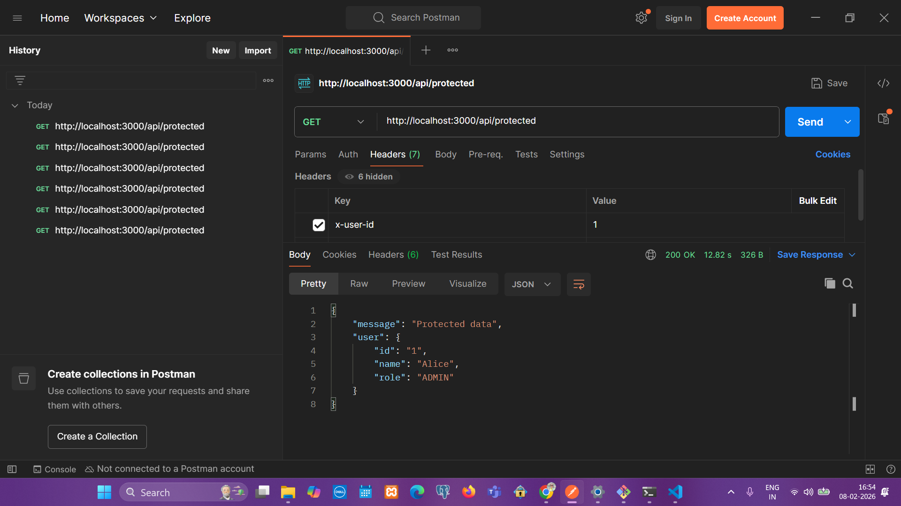
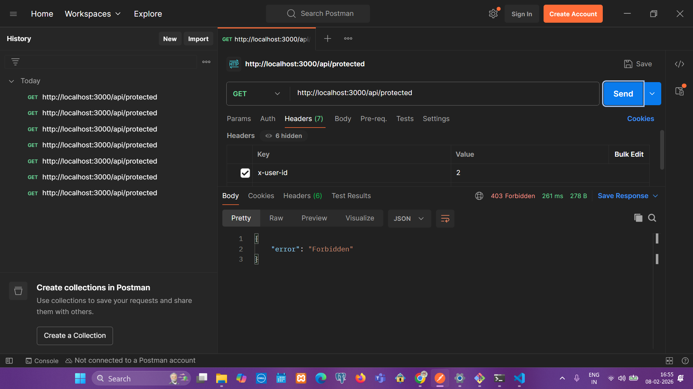
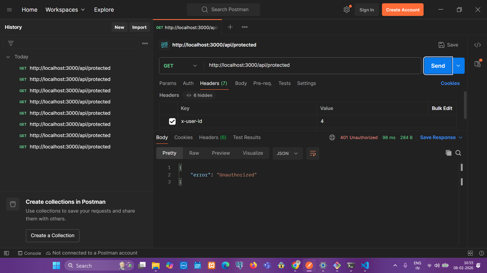

# Next.js Backend Assignment – Role-Based API (Mock Data)

## Overview

This project is a minimal **Next.js (App Router)** backend-focused application created as part of a technical assignment.

The objective is to demonstrate:
- Backend API structure in Next.js
- Simple authentication and role-based authorization
- Clean, readable code organization
- Thoughtful separation of concerns

To keep the focus on logic and structure, **mock in-memory data** is used instead of a database.

---

## Tech Stack

- Next.js (App Router)
- TypeScript
- Node.js
- Mock in-memory data
- Postman (for API testing)

---

## Project Structure
```
src/
├── app/
│   ├── api/
│   │   ├── protected/
│   │   │   └── route.ts
│   └── page.tsx
├── lib/
│   └── auth.ts
├── └── users.ts
└── types/
    └── user.ts
```

### Structure Rationale

- **`app/api/*`**  
  Contains API routes using the Next.js App Router pattern.

- **`data/`**  
  Centralized mock data layer to simulate a database.

- **`lib/`**  
  Reusable business logic such as authentication and role checks.

- **`types/`**  
  Explicit TypeScript interfaces to avoid implicit contracts.

---

## User Model

The application uses a simple user model:
```ts
{
  id: number
  name: string
  role: "admin" | "user"
}
```

This model is defined in `types/user.ts` and reused across the application.

---

## Mock Data Layer

Mock users are defined in:
```
src/data/users.mock.ts
```

Example:
```ts
export const users = [
  { id: 1, name: "Alice", role: "admin" },
  { id: 2, name: "Bob", role: "user" }
]
```

This structure allows easy replacement with a real database later.

---

## API Endpoints

### GET `/api/protected`

A protected route that only allows access to users with the `admin` role.

**Required Header:**
```
x-user-id: 1
```

**Success Response:**
```json
{
    "message": "Protected data",
    "user": {
        "id": "1",
        "name": "Alice",
        "role": "ADMIN"
    }
}
```

**Unauthorized/Forbidden Response:**
```json
{
    "error": "Forbidden"
}
```

---

## Running the Project Locally

### Install dependencies
```bash
npm install
```

### Start the development server
```bash
npm run dev
```

### Access the app
```
http://localhost:3000
```

---

## Testing the API

The APIs can be tested using **Postman**.

**Example request:**
```
GET http://localhost:3000/api/protected
Header: x-user-id: 1
```

Screenshots of Postman requests and responses can be added below.




---

## Future Enhancements

- Replace mock data with a real database (PostgreSQL, MongoDB, etc.)
- Implement JWT-based authentication
- Add input validation and error handling middleware
- Add unit tests

---
